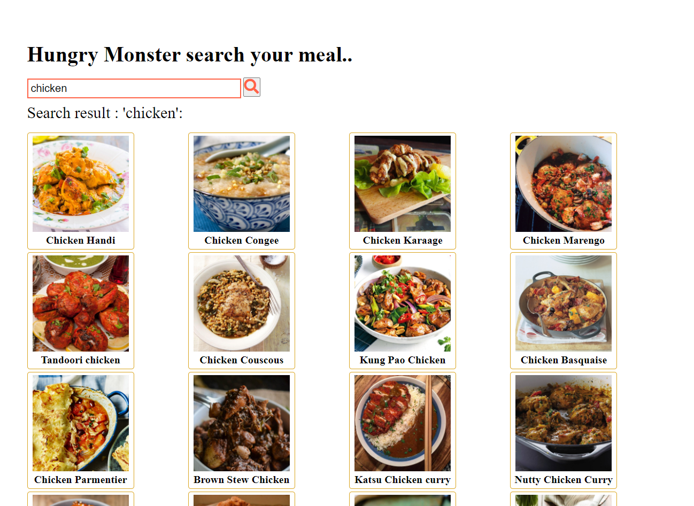

# Project: Hungry Monster
<h1><a href="https://rubeldiu.github.io/hungry-monster/">Live</a></h2>
## Feature

In this project, user can search the food and will get ingredients of the food. Image data is comming from the Api name :  https://www.themealdb.com

## Technology
-JavaScript
-DOM Maniulation
-Fetch API
-HTML,CSS

<h2>Project screenshot</h2>

